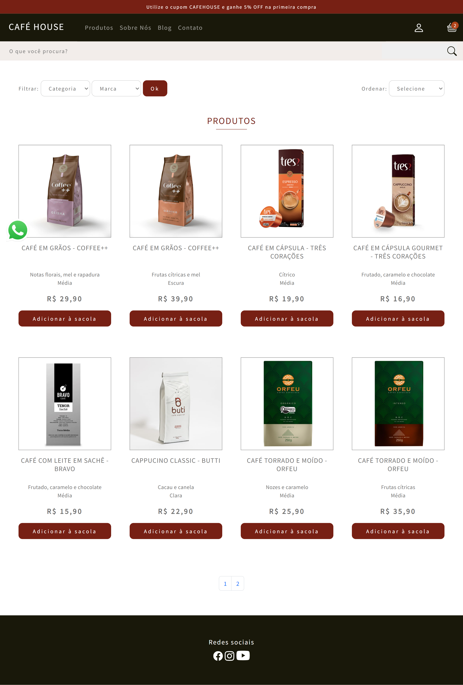
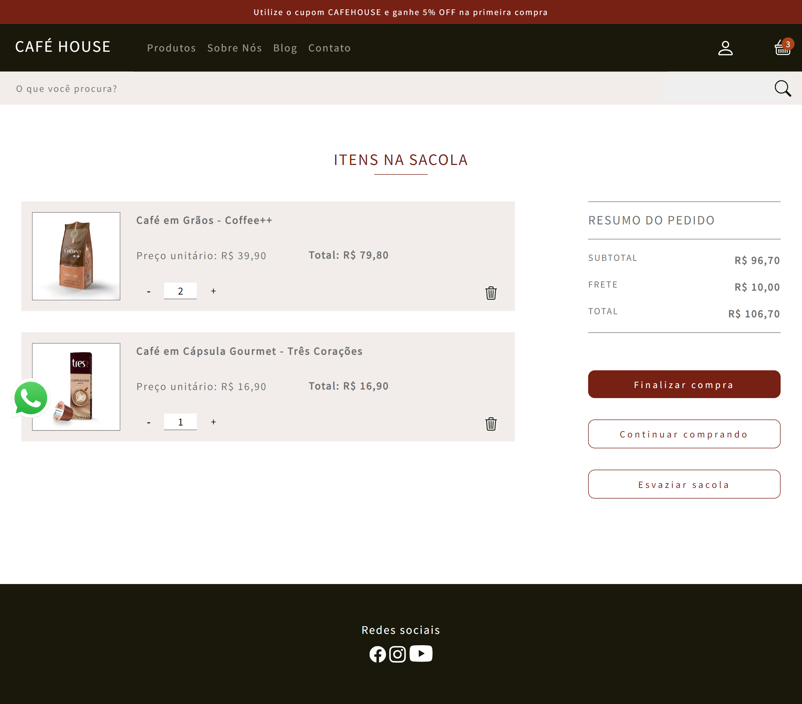
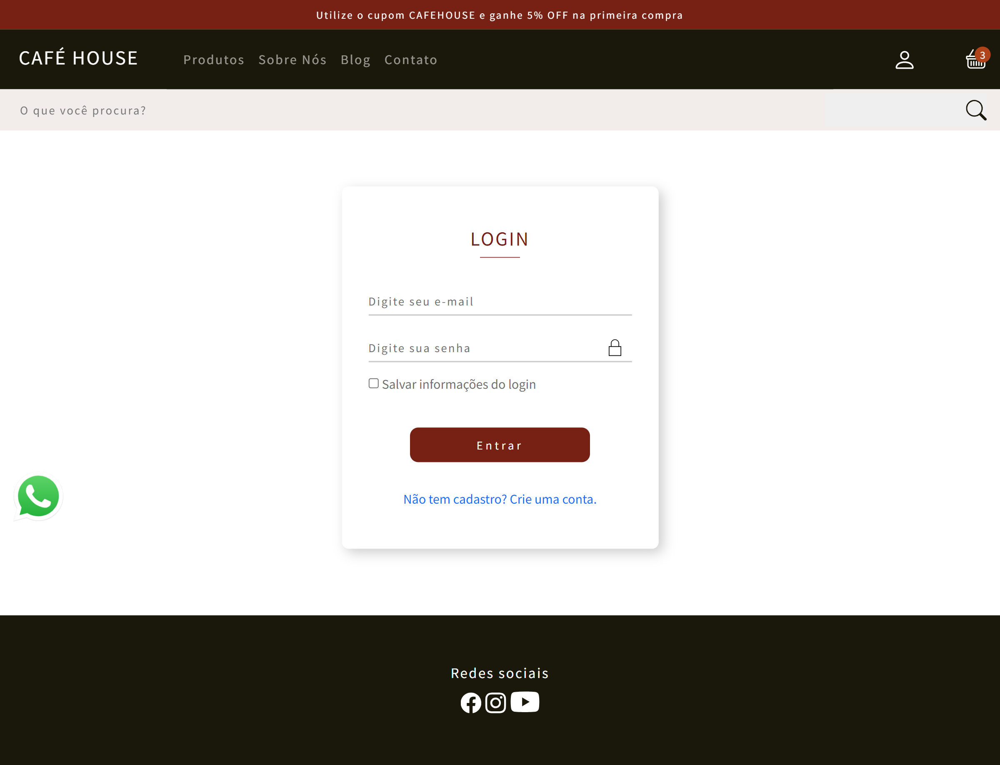

# E-commerce Café House :coffee:

## Sobre o projeto :information_source:

Ecommerce de cafés desenvolvido como projeto integrador no curso de Full Stack da Digital House. Funcionalidades: busca por palavras-chave, filtro por categoria e marca, carrinho de compras, autenticação de usuário, além de área administrativa que permite  o crud de produtos, marcas e categorias da loja. 

---

## Tecnologias :wrench:

As tecnologias usadas foram:

- HTML
- CSS
- JavaScript
- Node.js
- Express
- MySQL
- Sequelize

---

## Desenvolvedores 💻

[**Bruno Sanches**](https://github.com/BrunoSan1991)
>
[**David Manente**](https://github.com/davidsmanente)
>
[**Isabela Toledo**](https://github.com/isabellactac)
>
[**Leon Guilherme**](https://github.com/Leon0887-dev)
>
[**Ligia Pretel Eimantas**](https://github.com/ligiapretel)
>
[**Renan Tyga**](https://github.com/RenanTyga)